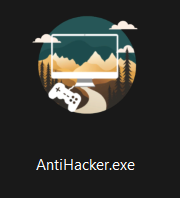
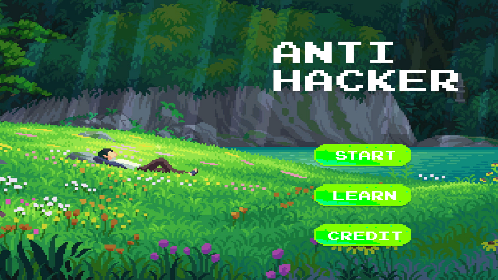
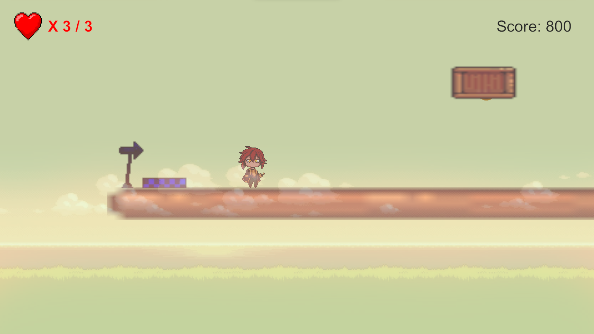

# ANTIHACKER

## Nội dung 

- [Hướng dẫn và Mô tả]()

- [Cách chơi]()

### Hướng dẫn và mô tả

- Bản unity : 2021.3.18f1
- Mở unity xem gameplay trong floder `Asset` -> `Scenes` -> `Round3`
- Cơ chế game : `Intro` -> `GamePlay` -> `Phishing` / `Privacy`

- Chơi gameplay : floder tải hết tất cả trong floder [link sau](https://drive.google.com/drive/folders/1NiiqeDtWQ85AmHIQeHWbMkT4d3DX5R_E?usp=sharing)  -> chạy file `AntiHacker.exe` 

    

- **Mô tả**: Game 2D phiêu lưu với những thử thách khác nhau liên quan đến các vấn đề bảo mật. Đồng thời 

### Cách chơi 

- Chọn Start để bắt đầu game
    

- Người chơi có thể đọc/ học thêm kiến thức trước khi chơi sau khi bấm vào nút `learn` và sau đó có thể `play quiz`. Quiz sẽ gồm 4 câu trả lời sai 1 câu sẽ thua. *Phần này sẽ được cập nhật thêm trong thời gian sớm nhất*

    
    
- Cách di chuyển
    
    - `D` : qua phải 

    - `W` : nhảy lên 

    - `A` : qua trái

    

- Chạm quái vật 

    

    

- Trả lời câu hỏi trả lời đúng không bị mất máu. Đồng thời trở về điểm xuất phát.

- Người chơi rớt xuống sẽ không mất máu nhưng chạm phải các `trap` thì mất máu.

- Tag: `Game Parkour` , `Quiz` , `Networking` , `Phishing`, `Privacy`.

